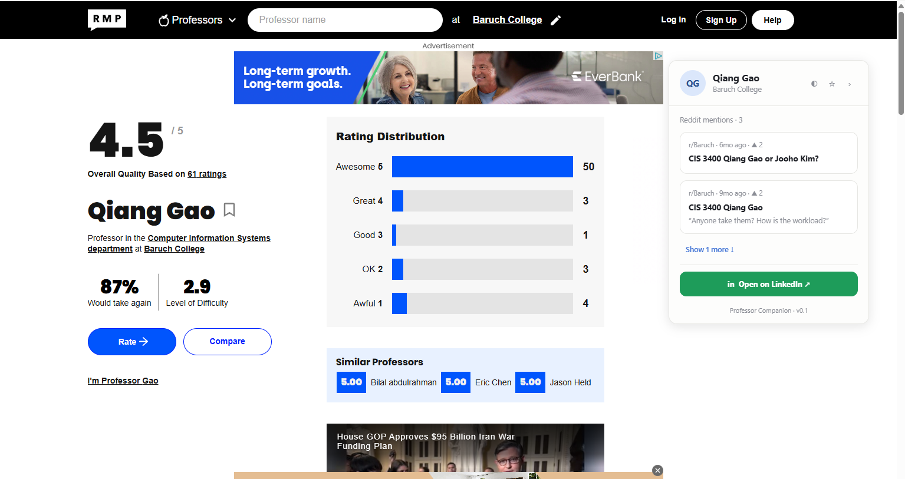
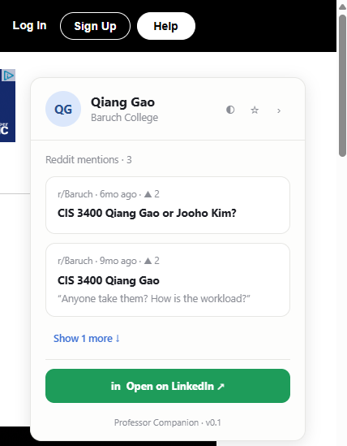
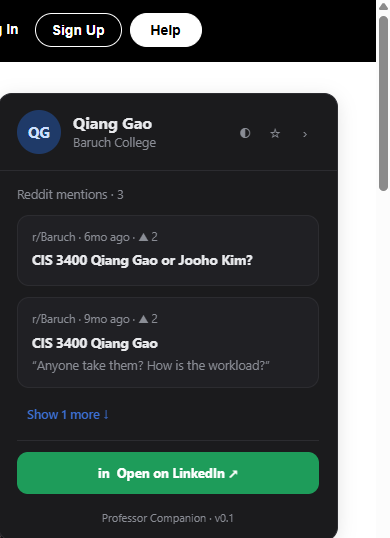
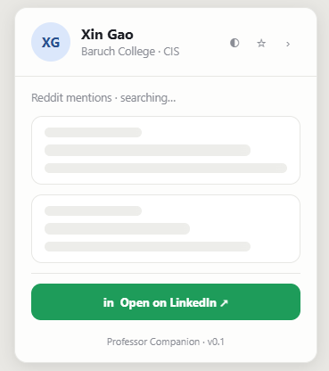
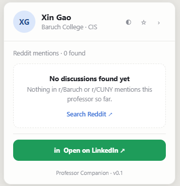
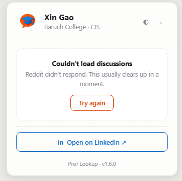

# Professor Companion

A Chrome extension (Manifest V3) that enriches Rate My Professors professor pages with what students actually say — real Reddit discussions, surfaced in a sidebar right on the professor's page, plus a one-click LinkedIn lookup.

**Who it's for:** students choosing classes who want more than a star rating. Built by two CUNY students, so CUNY subreddits (r/Baruch, r/CUNY, r/hunter) are searched first — but it works on any RMP professor page. No accounts, no tracking; it only reads public Reddit data.

## Features

- **Automatic professor detection** on RMP professor pages — SPA-aware, so it keeps up with client-side navigation. Detection is keyed to the professor ID in the URL, and results can never render under the wrong professor.
- **Real Reddit threads:** CUNY subreddits searched first (one multireddit request), then sitewide; results deduped and CUNY-ranked, up to 10 cards, collapsed to 2 with a show-more toggle.
- **Clean previews:** markdown stripped, bare URLs removed, snippets truncated at word boundaries — and every piece of Reddit text is rendered via `textContent`, never `innerHTML`, so untrusted input can't inject markup.
- **LinkedIn lookup:** one click opens a Google search scoped to `linkedin.com/in` for the detected professor and school.
- **A sidebar that stays out of your way:** light/dark/auto theme, collapsible to a floating tab, draggable (card by its header, tab along the right edge), with positions and preferences remembered.
- **Polite to Reddit:** a per-tab 10-minute search cache stops repeat visits from re-fetching; failures degrade to an empty card with a manual search link.

## Architecture

```
RMP professor page
└─ content.js ──── detects professor from /professor/<id> in the URL;
   │               distrusts DOM/title after SPA navigation until they change
   │               (staleness gates), mounts the sidebar, renders results
   ├─ reddit.js ── builds CUNY + sitewide search queries, parses Reddit's
   │               Listing JSON, ranks/dedupes, caches per tab, sanitizes snippets
   │        │ message
   │        ▼
   ├─ background.js ── service worker fetch proxy: content scripts are CORS-
   │               blocked from reddit.com, so the worker (with host_permissions)
   │               fetches on their behalf — behind a strict allow-list
   │               (HTTPS + known Reddit hosts + .json paths only)
   └─ sidebar (sidebar.html + styles.css) ── mounted in a Shadow DOM root so
                   styles can't leak either way; a data-state CSS machine drives
                   loading / loaded / empty; up to 10 sanitized cards
```

Settings (theme, collapsed state, drag positions) live in `chrome.storage.local`, are applied **before the sidebar's first paint** (no theme flash, no layout snap), and sync across tabs via `storage.onChanged`.

## Development: load unpacked

1. Clone the repo.
2. Open `chrome://extensions`, enable **Developer mode** (top right).
3. Click **Load unpacked** and select the repo folder.
4. Visit any Rate My Professors professor page — the sidebar appears once a professor is detected.

After editing code, click the extension's **reload** (↻) button on `chrome://extensions` and refresh the RMP tab — Chrome caches the service worker and orphans old content scripts, so a reload-plus-refresh is the only state that matches what's on disk.

## Screenshots

<!-- TODO: add screenshots (light + dark, expanded + collapsed tab) -->

*Coming soon.*

| Light | Dark | Collapsed |
|---|---|---|
|  |  |  |

### Designed for every state

Reddit is slow sometimes, and some professors have no threads at all. Both cases
get a real screen instead of a blank card.

| Loading | No discussions | Reddit unavailable |
|---|---|---|
|  |  |  |

## Demo

<!-- TODO: add demo GIF (search page → professor → sidebar loads → show more → LinkedIn) -->

*Coming soon.*

## Built By

- **Antony Wu** — product & extension logic: `content.js`, `reddit.js`, `background.js`, `manifest.json`
- **Jinge Huang** — UI/UX: `sidebar.html`, `styles.css` (wireframes in `/mockups`)

## v2 Roadmap

- **AI summary card** — a short summary of the fetched threads (IBM watsonx behind a small proxy, the project's first backend). Hard constraint, stated verbatim: **summarizes only fetched posts, never model knowledge about the professor.**
- **LinkedIn one-click** — jump straight to the top profile result (Google CSE API) instead of a search page.
- **Saved professors** — the star button gets a home: a saved-professors view.
- **Progressive disclosure & drag docking** — richer card interactions and snap-to-edge sidebar placement.
- **Standalone web app** — evaluate expanding beyond the extension once the MVP is published.
